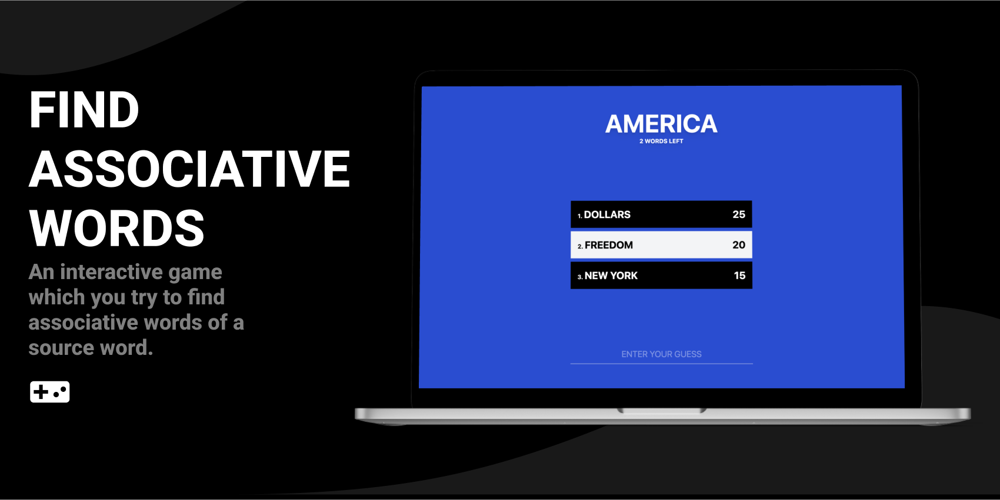

# Find Associative Words

  

> Version 2 with real-time remote is out (for those who can self-host the game)! [Check it out here](https://github.com/eggsy/find-associative-words/tree/socket).

A game in which you try to find [associative words](https://en.wikipedia.org/wiki/Associative_meaning) (like tires, seats, and wheel of a car--the source word) of a source word. The idea is based on the Family Feud show but we use a single word instead of phrases or events.

## Rules / How to Play

Whilst there are no specific rules, and you can play it in any way you want, I wanted to note how we played it during my presentation in the classroom.

- Create two teams with at least 2 people each.
- Each team has to select a team leader to race against the other leader to gain the guessing right.
- Find a table, put an _object_ on it and let leaders surround it, the item should be in between the leaders.
- Make sure their hands are in their back.
- Start the game, click on "Let's Play" and wait for the word to show up.
- The first leader to take the _object_ from the table will try to guess an **associative word** to the source word.
- If they guess one right word, their team starts. If not, other leader tries to guess until one of them guesses right.
- The starting team has 3 chances to guess the rest of the associative words.
- Once the starting team is out of chances, the other team starts to guess but they only have one chance.
- If they guess it right, they take all of the points, if not, the starting team takes all.
- Then teams select another leader and you move on to the next word.

You can shape the game as you wish, but remember, although rules are simple, there's a chance that they might get confused so make sure you introduce the game correctly before you start playing.

## Moderator Control

Moderator is the presenter and the ruler of the game. They can choose words and associative words to it, they can overwrite the rules and play the game however they want. They could also use phrases or events instead of words if they wish.

There is also an additional page for the moderator. One is [`/list`](https://associative-words.netlify.app/list) which the words in the config are listed with their associative words so that they could remember and type it in a case when someone says "tv show" to "Friends" but your associative word is "series". One another is [`/create`](https://associative-words.netlify.app/create) which allows the moderator to create a word config easier with a few clicks.

There are two control buttons on the game page, the first one resets the game and gets a random word, and the second one reveals a random word of the source word; this button can be used to reveal after two teams fail to guess any or some of the words.

## Note

The game is in its early stage, it was developed under 4 hours of work and there are only simple words with simple associative words. To play and enjoy the game, you should think of better words with better associative words.

**I will improve the game** in the future, I will make it so it won't get you the words you played during the session.

## License

MIT License © 2022 [Abdulbaki "EGGSY" Dursun](https://github.com/eggsy)
