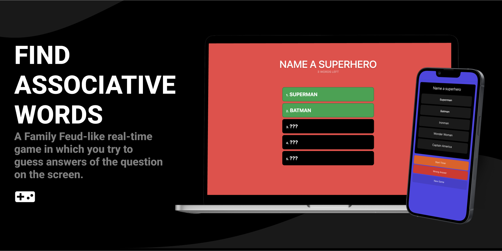

# Find Associative Words v2

  

A _Family Feud-like_ game which supports real-time connection! [Checkout the public (old) version here](https://associative-words.netlify.app/). For now, this game can't be publicly shared since it is currently a **self-hosted** game, but in the future, I might add ability to create accounts, quizzes and playing them in your classroom, activity or somewhere else.

### Self-hosting

Clone this repo, change the questions at `client/src/assets/questions.ts`, run the game in development mode from the directory (the directory that contains `client` and `server` folders) via the NPM script `dev`. This will open up a browser window and display a QR code in your terminal. Simply put your phone (or controller device) camera to that code and access the control page. **BOTH DEVICES MUST SHARE THE SAME INTERNET**, this doesn't mean the game requires an internet connection. You will see when you click on any button from your controller device, it will trigger an update on the game and reveal answers, start timers, moves to next questions etc..

## License

MIT License © 2022 [Abdulbaki "EGGSY" Dursun](https://github.com/eggsy)
